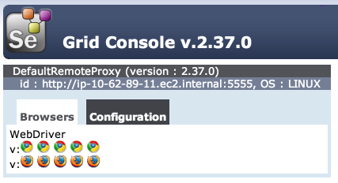

 Selenium Grid 
=============


This is qubell component, that allows to create selenium-grid in few clicks.

Reasoning
---------

Usually it is a pain to wait until your tests on your local browser is over. And you cannot do other staff because mouse movements, key clicks may fail results. And in most reason it is hard to parallel.
Selenium Grid is designed to be used in distributed environment and do not borow your local browsers. 

Why not to get Selenium Grid on demand, bean able add nodes to hub easily, extensivly use parallelization.

So what drove us:
- easy to deploy
- cheap when small
- easy to integrate
- focus only on fast browsers
- one click extending

Quick Start
-----------

Compoent is configured for quick launch with AWS EC2.

> Before you start working with it within the Qubell platform, you need to obtain an AWS account, capable of creating EC2 nodes. The EC2 security group ‘default’ has to allow connections on the following ports:
> - 22 (SSH)
> - 4444 (Selenium Hub)

1. Grab component by "Get it now" from [here](_resources/grid.html) to you prefered organization.
2. Configure if `Platform`->`Cloud Account` hasn't configured AWS
3. Configure if `Environment`->`default` hasn't associated Cloud Account
4. Go to `Applications` and press `[Launch]`
5. Wait
6. On Done, you should see remote-url and console-url set

Now you can visit console-url. You should see something like:  



Let's do some test that it works. We'll use python and selenium-bindings
- Install selenium-binding via terminal `sudo pip install selenium`
- Launch `python`

``` python
>>> """we have to import some staff"""
>>> from selenium import webdriver
>>> from selenium.webdriver.common.desired_capabilities import DesiredCapabilities

>>> remoteUrl = 'use remote-url from grid instance here'
>>> driver = webdriver.Remote(
   command_executor=remoteUrl,
   desired_capabilities=DesiredCapabilities.CHROME)
   
>>> """Now open console-url"""
>>> """You should see that one chrome icon is in shade"""
>>> """This is your allocated browser in the cloud"""

>>> """Let's check out what it can"""
>>> driver.get("http://qubell.com")
>>> driver.title
u'Qubell - Adaptive Enterprise Platform-as-a-Service (PaaS)'

>>> "Congratulations you've got ready to use selenium grid"
```

Actuall steps, except waiting should not exceed 5 mins. If it took more, let us know at support@qubell.com.

Under the Hood
--------------

In generally selenium grid component uses 1+n machines.
One machine is used for hub and also have installed node. We think it is reasonble when you really need cheap topology.
Other n machines are exclusivly for nodes.

These all are setup and managed via chef cookbooks.
Deployed Selenium Grid supports only Selenium 2.0 (WebDriver) and Selenium 1.0 is turned off as obsolete platform.

Cookbooks has much more power in it, and not everything are shown. You may need to configure grid in a very specific way, we'll document more as requests will come.

Setup and Manage
----------------

This should help you tune grid in Qubell PaaS Organization.

You would need to have a Cloud Account. Static pool is hardly supported yet.

On start you may define:
 - cookbooks uri, you may use your own
 - newer version of selenium
 - initial slaves count, meaning number of pure nodes

Via environemnt policies you may override following:
  selenium-provision.vmIdentity
  selenium-provision.imageId
  selenium-provision.hardwareId
  
During runtime you may configure amount of nodes via `scale` command.
Also special `restart` command is provided in a case if something went wrong.

###Supported Operation Systems

It was tested on Ubuntu 12.04 LTS, others should work too.

FAQ
---

Q: Don't know nothing what is selenium and grid. What is it?  
A: Read http://www.seleniumhq.org/projects/webdriver and https://code.google.com/p/selenium/wiki/Grid2

Q: Example is in Python, is it only supported language?  
A: Python was used as easiest example. Selenium is cross platform, follow [this](http://www.seleniumhq.org/download) for more 

Q: What about other browsers?  
A: We have focused on Chrome and Firefox as they pretty fast and easy to deploy. If you need IE or others you may connect them as standalone nodes. For a cross-browser testing we suggest to use cloud servcies.

Q: Can you extend for 'this'? or I have extended?  
A: Cool! Create a pull request or issue and we'll review and proccess it.
